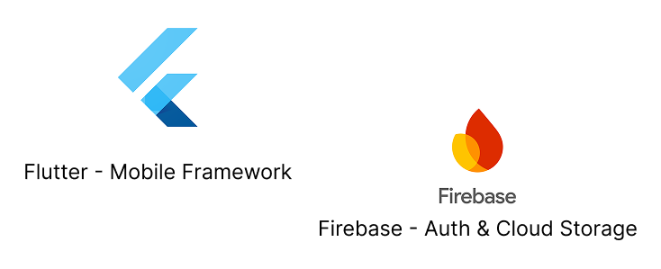
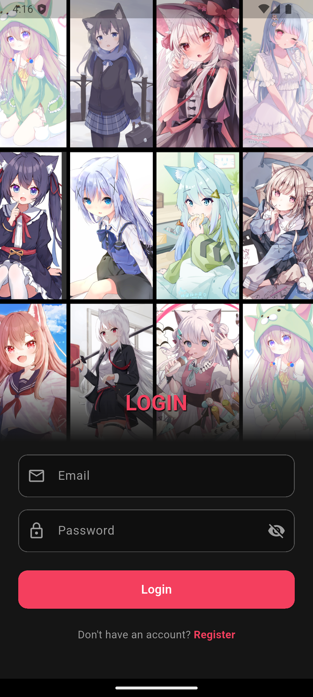
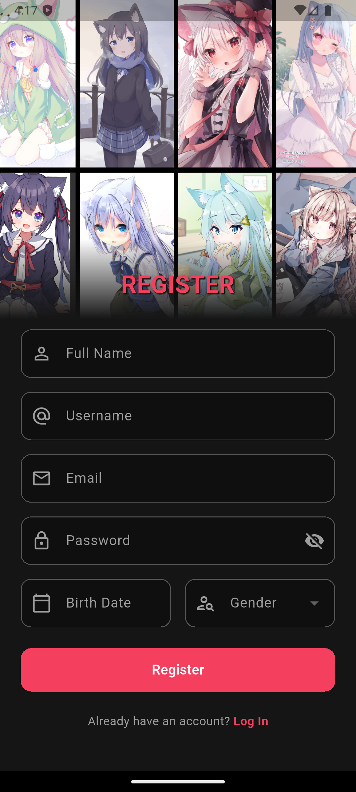
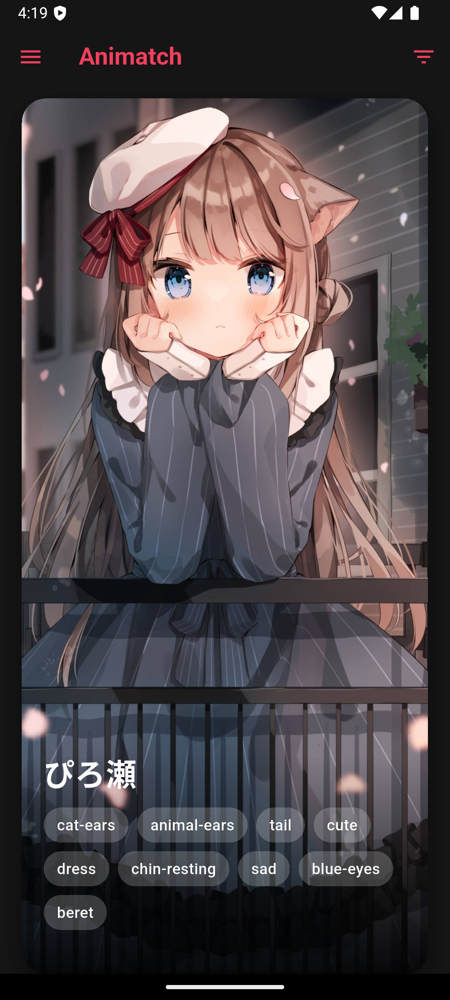
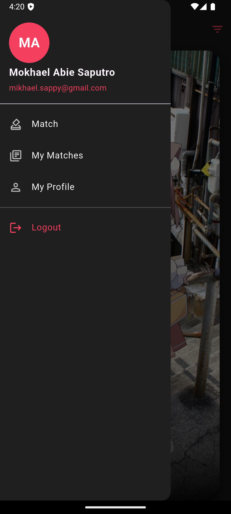
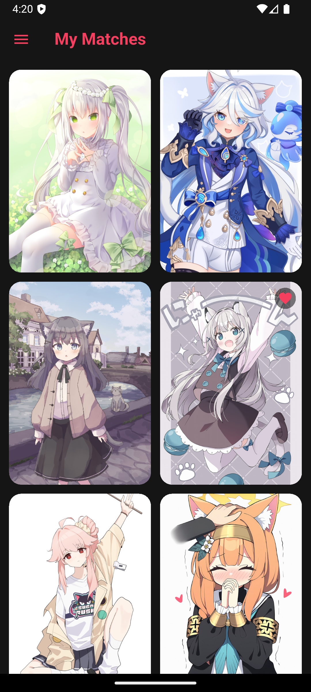
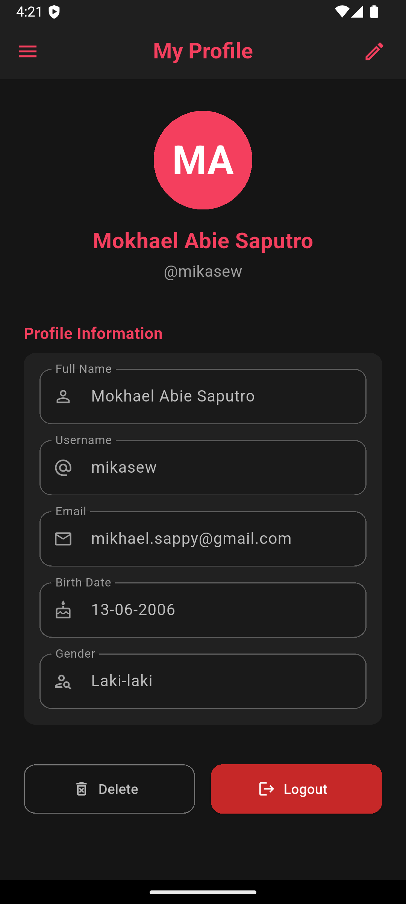

# Final Project Pemrograman Perangkat Bergerak (C)

## 📱 Animatch

Aplikasi *Tinder-like* untuk mencari karakter anime.

---

## 👥 Team Members
| Name                 | NRP        | Class   | Contribution                                            |
| -------------------- | ---------- | ------- | ------------------------------------------------------- |
| Mikhael Abie Saputra | 5025221113 | PPB (C) | _API service, Tags(CRUD) service_                       |
| Adnan Abdullah Juan  | 5025221155 | PPB (C) | _Project setup, Firestore service, Match(CRUD) service_ |
| Faiq Lidan Baihaqi   | 5025221294 | PPB (C) | _FireAuth service, User(CRUD) service, Navigation_      |

---

## 📝 Description
### Main Features
Fitur-fitur utama yang ada didalam aplikasi antara lain:
- Autentikasi user
- Update profile dan hapus akun user
- *Match* dengan karakter anime
- Menggunakan tags untuk search spesifik dan blacklist yang tidak sesuai dengan selera
- Melihat list karakter anime yang sudah di *match*, menghapus match, dan membuat karakter menjadi favorit

### Tech Stack


### Public API
Semua gambar karakter anime pada aplikasi ini diambil dari API publik **Nekosia.cat**.

Dokumentasi API publik Nekosia.cat:<br>https://nekosia.cat/documentation?page=api-endpoints#tags-endpoint

---

## 📸 Screenshots

### Login/Register screen
<div style="display: flex; justify-content: space-evenly; align-items: center;">
    
    
</div>

### Match screen
<div style="display: flex; justify-content: space-evenly; align-items: center;">
    
</div>

### Navigation drawer
<div style="display: flex; justify-content: space-evenly; align-items: center;">
    
</div>

### Match list screen
<div style="display: flex; justify-content: space-evenly; align-items: center;">
    
</div>

### Profile screen
<div style="display: flex; justify-content: space-evenly; align-items: center;">
    
</div>

### Match demo
<div style="display: flex; justify-content: space-evenly; align-items: center;">
    
</div>

_May take some time to load_

### Tags selection
<div style="display: flex; justify-content: space-evenly; align-items: center;">
    
</div>

_May take some time to load_

---

## 🚀 Getting Started

run command berikut untuk menjalankan aplikasi untuk debug

```bash
flutter pub get
flutter run
